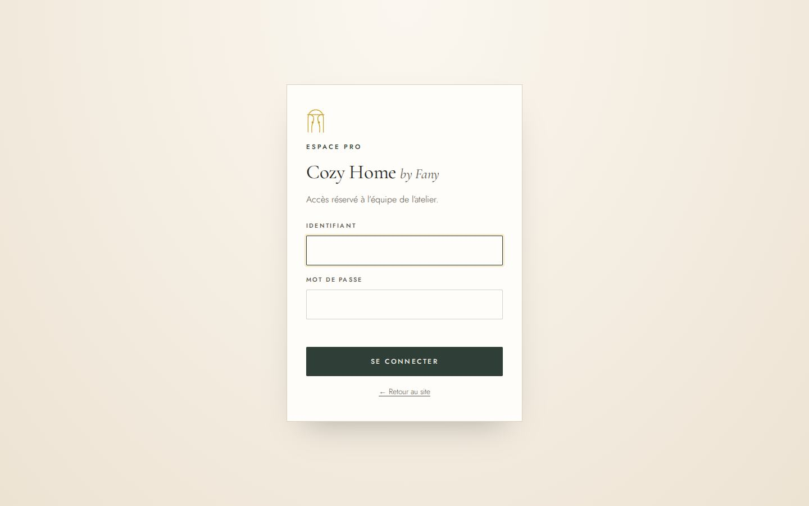
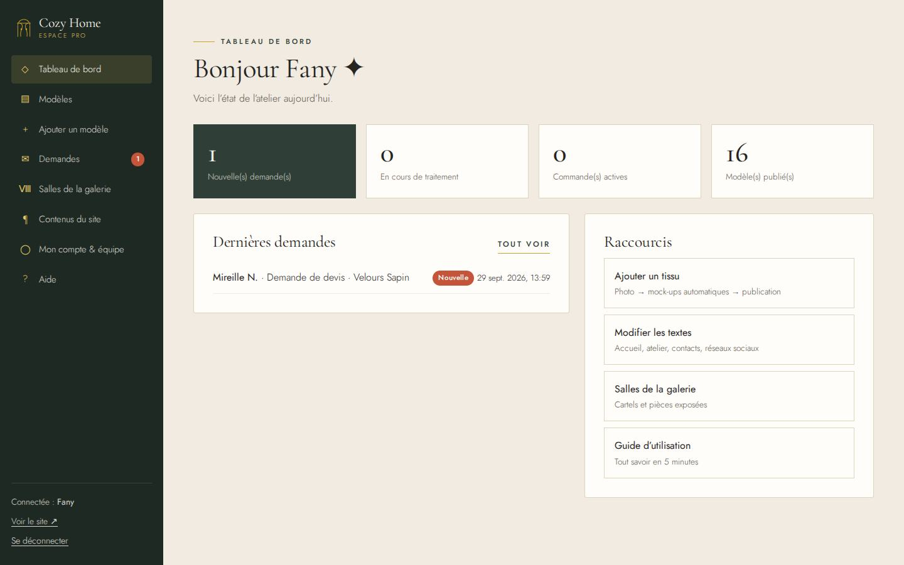
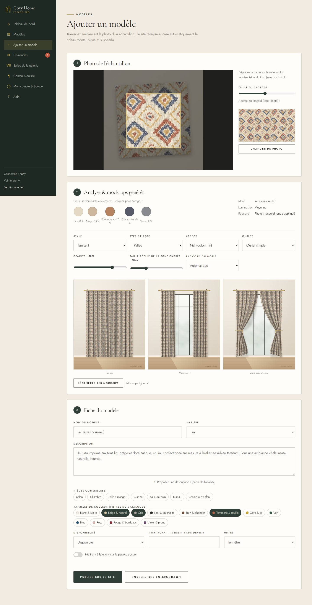
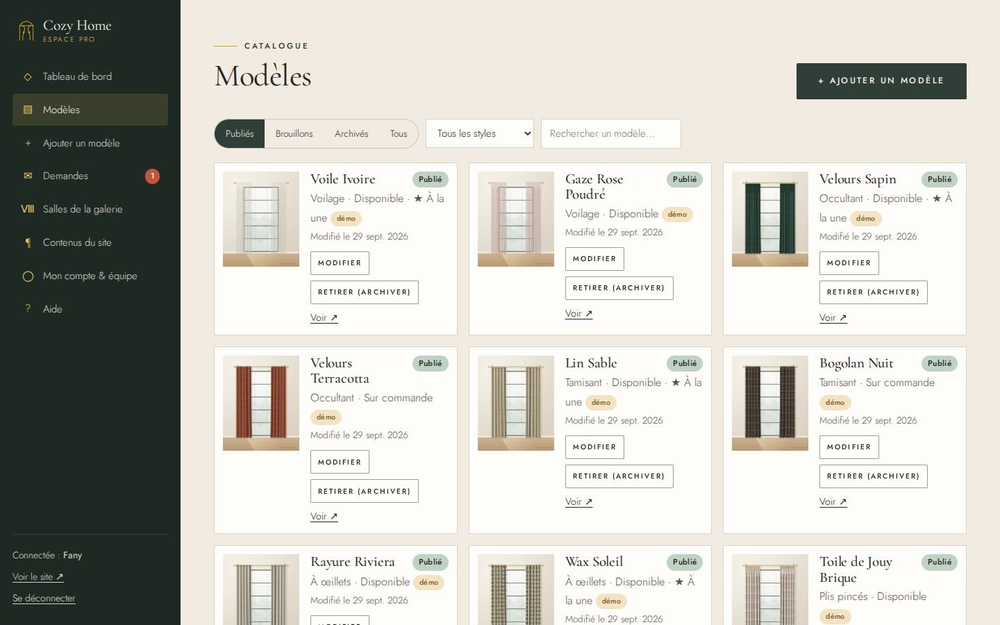
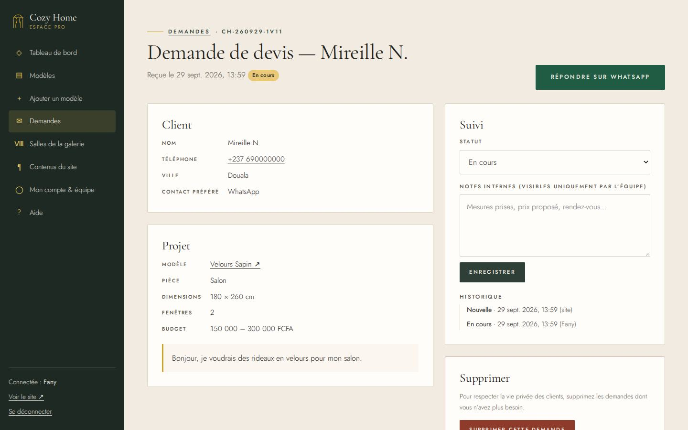
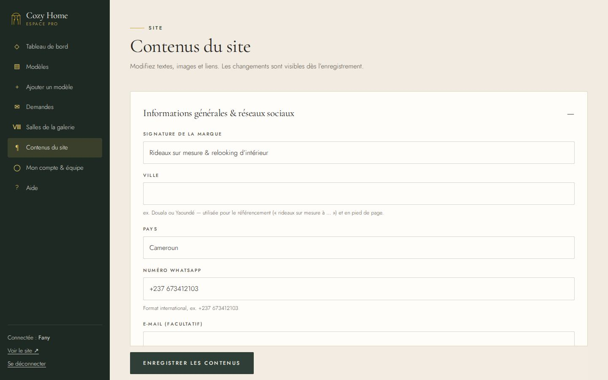

# Guide de l’espace pro — Cozy Home by Fany

Ce guide permet à Fany et à son équipe de gérer le site **sans aide technique**.
Un résumé est aussi disponible directement dans l’espace pro, menu **Aide**.

---

## 1. Se connecter

1. En bas de n’importe quelle page du site, cliquez sur **🔑 Espace pro** (ou allez sur `votre-site/admin`).
2. Saisissez votre **identifiant** et votre **mot de passe**.
3. Première connexion : allez tout de suite dans **Mon compte & équipe** pour choisir votre propre mot de passe.

> Il n’existe pas d’inscription publique : seuls les comptes créés par Fany peuvent entrer.
> Après 6 essais erronés, la connexion est bloquée 15 minutes.

## 2. Le tableau de bord

Il affiche en un coup d’œil les **nouvelles demandes**, celles **en cours**, les **commandes** et le nombre de
**modèles publiés**, ainsi que les dernières demandes reçues et des raccourcis.

## 3. Ajouter un nouveau tissu (avec mock-ups automatiques)

Menu **Ajouter un modèle** :

1. **Photo de l’échantillon** — *Choisir une photo* (ordinateur) ou *Prendre une photo* (téléphone).
   Photographiez le tissu **à plat, de face, à la lumière du jour, sans ombre**. Un simple morceau suffit.
2. **Cadrage** — déplacez le cadre doré sur la plus belle zone du tissu (sans bord ni pli) ; le curseur *Taille du
   cadrage* l’agrandit ou le réduit. L’aperçu « raccord » montre le tissu répété.
3. **Analyse & mock-ups** — le site détecte automatiquement les **couleurs dominantes**, le **type de motif**
   (uni, texturé, rayé, imprimé) et fabrique **trois visuels** : rideau **fermé**, **mi-ouvert** et **avec embrasses**,
   déjà coupé, plissé et suspendu à sa tringle dans le présentoir de l’atelier.
   Vous pouvez ajuster :
   - **Style** (voilage, occultant…) : applique la pose et l’opacité habituelles de ce style ;
   - **Type de pose** (œillets, plis pincés, passe-tringle, pattes, anneaux), **Aspect** (mat, velours, satiné, voile),
     **Ourlet** (simple ou franges) ;
   - **Opacité** : faible pour un voilage, 100 % pour un occultant ;
   - **Taille réelle de la zone cadrée** : mesurez la largeur réelle du morceau cadré (ex. 30 cm) pour que le motif
     ait la bonne échelle sur le rideau ;
   - **Raccord du motif** : *automatique* convient presque toujours.
   Cliquez sur une pastille de couleur pour la corriger si besoin.
4. **Fiche du modèle** — nom, description (le bouton *✦ Proposer une description* rédige un premier jet),
   pièces conseillées, familles de couleur (utilisées par les filtres), disponibilité, prix (vide = « sur devis »),
   *à la une* (affiché sur l’accueil).
5. **Publier sur le site** — les images sont compressées automatiquement (version grande + version mobile), puis
   envoyées sur Cloudflare ; le message de confirmation indique le poids obtenu. Le modèle apparaît aussitôt au
   catalogue, dans la galerie et dans *Compose ton intérieur*.
   *Enregistrer en brouillon* le garde invisible pour le terminer plus tard.

## 4. Modifier, retirer ou restaurer un modèle

Menu **Modèles** : onglets *Publiés / Brouillons / Archivés*, recherche et filtre par style.

- **Modifier** : change la fiche ; choisissez une nouvelle photo pour régénérer les visuels.
- **Retirer (archiver)** : le modèle disparaît du site mais reste conservé. **Restaurer** le republie.
- Tissu provisoirement indisponible ? Gardez-le en ligne avec la disponibilité *Sur commande* ou *Momentanément épuisé*.
- **Supprimer** (brouillons et archivés uniquement) est définitif.

## 5. Suivre les demandes (devis, conseils, commandes)

Menu **Demandes** (le compteur rouge indique les nouvelles demandes).

- Par défaut, la liste montre les demandes **à traiter** ; filtrez par type ou statut, cherchez par nom ou téléphone.
- En ouvrant une demande, elle passe automatiquement **En cours**.
- **Répondre sur WhatsApp** ouvre la conversation avec un message déjà rédigé.
- Si le client a utilisé *Compose ton intérieur*, sa **composition** (image, décor, tissus, pose) est jointe.
- Mettez à jour le **statut** (*Réponse envoyée*, *Terminée*, *Archivée*) et vos **notes internes** (mesures, prix
  proposé, rendez-vous) puis *Enregistrer*. L’historique garde la trace de chaque étape.
- Supprimez les demandes dont vous n’avez plus besoin (vie privée des clients).

## 6. Modifier les textes, images et liens du site

Menu **Contenus du site** : une rubrique par page (Informations générales, Accueil, Galerie, Catalogue,
Compose ton intérieur, Contact, L’Atelier, Confidentialité, Référencement).

- Modifiez les textes puis **Enregistrer les contenus** (en bas).
- **Images** : *Remplacer* → choisissez une photo ; elle est automatiquement compressée avant l’envoi (le poids
  avant/après s’affiche). Pensez ensuite à enregistrer.
  Remplacez notamment le visuel d’ouverture, les images des services, le portrait de Fany et les photos de l’atelier.
- **Réseaux sociaux** : le jour où Instagram ou Facebook existent, collez le lien — l’icône « bientôt » devient active.
- **Vidéos TikTok** : collez le lien de partage d’une vidéo (`https://www.tiktok.com/@cozyhomebyfany/video/…`) pour
  l’afficher sur l’accueil ; elle ne se charge que si le visiteur clique (site plus rapide).
- **Ville** : renseignez-la (ex. Douala) pour être trouvée sur Google avec « rideaux sur mesure à Douala ».
- **Référencement** : titres et descriptions affichés par Google ; `{lieu}` devient « à [ville] ».

## 7. Les salles de la galerie

Menu **Salles de la galerie** : pour chacune des 8 salles, modifiez le nom, le **cartel** (2-3 phrases façon musée),
la matière, l’ambiance, la **pièce exposée** (un modèle publié de ce style) et le **décor** de la salle.

## 8. Mon compte & l’équipe

- **Changer mon mot de passe** : 10 caractères minimum, lettres et chiffres. Les autres appareils connectés sont
  alors déconnectés.
- **Équipe** (réservé à Fany) : *Ajouter un membre* crée un compte avec un mot de passe provisoire à transmettre ;
  *Retirer* supprime l’accès immédiatement. Les membres de l’équipe ne peuvent pas gérer les comptes.
- Mot de passe oublié : sur Cloudflare, ajoutez au Worker le secret `ADMIN_PASSWORD_RESET` avec un nouveau mot de
  passe, ouvrez `/admin`, connectez-vous, puis supprimez ce secret (détails dans docs/DEPLOIEMENT-CLOUDFLARE.md).

## 9. Bonnes pratiques

- Les données sont sur Cloudflare (base D1) : aucune machine n’a besoin d’être allumée.
  Pensez à exporter régulièrement la base (voir docs/DEPLOIEMENT-CLOUDFLARE.md, « Sauvegarde »).
- Les 16 tissus fournis au lancement sont des **exemples de démonstration** : remplacez-les par vos créations
  (archivez-les ou supprimez-les au fur et à mesure) et vérifiez les prix.
- Déconnectez-vous sur un ordinateur partagé (bas du menu).
