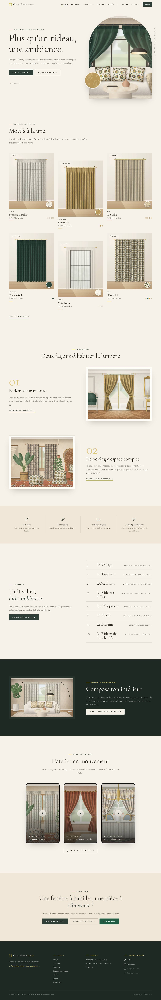

# Maquettes des pages clés

Captures du site fonctionnel (desktop 1440 px et mobile 390 px), régénérables avec `npm run maquettes`.
Les visuels de tissus, de décors et d’intérieurs sont produits par les moteurs du site
(les mêmes que ceux utilisés par l’espace pro) et seront remplacés par les vraies photos de l’atelier.

## Espace visiteur

| Page | Desktop | Mobile |
|---|---|---|
| Accueil | [desktop-accueil.jpg](maquettes/desktop-accueil.jpg) | [mobile-accueil.jpg](maquettes/mobile-accueil.jpg) |
| La Galerie (exposition) | [desktop-galerie.jpg](maquettes/desktop-galerie.jpg) | [mobile-galerie.jpg](maquettes/mobile-galerie.jpg) |
| Galerie — comparateur avant / après lumière | [desktop-galerie-salle-avant-apres.jpg](maquettes/desktop-galerie-salle-avant-apres.jpg) | [mobile-galerie-salle-avant-apres.jpg](maquettes/mobile-galerie-salle-avant-apres.jpg) |
| Catalogue | [desktop-catalogue.jpg](maquettes/desktop-catalogue.jpg) | [mobile-catalogue.jpg](maquettes/mobile-catalogue.jpg) |
| Fiche modèle + mise en situation | [desktop-fiche-modele.jpg](maquettes/desktop-fiche-modele.jpg) | [mobile-fiche-modele.jpg](maquettes/mobile-fiche-modele.jpg) |
| Compose ton intérieur | [desktop-composer.jpg](maquettes/desktop-composer.jpg) | [mobile-composer.jpg](maquettes/mobile-composer.jpg) |
| Formulaire de devis | [desktop-devis.jpg](maquettes/desktop-devis.jpg) | [mobile-devis.jpg](maquettes/mobile-devis.jpg) |
| Devis avec composition jointe | [desktop-devis-avec-composition.jpg](maquettes/desktop-devis-avec-composition.jpg) | [mobile-devis-avec-composition.jpg](maquettes/mobile-devis-avec-composition.jpg) |
| Tunnel de commande | [desktop-commande.jpg](maquettes/desktop-commande.jpg) | [mobile-commande.jpg](maquettes/mobile-commande.jpg) |
| L’Atelier | [desktop-atelier.jpg](maquettes/desktop-atelier.jpg) | [mobile-atelier.jpg](maquettes/mobile-atelier.jpg) |

## Espace pro

| Écran | Capture |
|---|---|
| Connexion | [admin-connexion.jpg](maquettes/admin-connexion.jpg) |
| Tableau de bord | [admin-tableau-de-bord.jpg](maquettes/admin-tableau-de-bord.jpg) |
| Liste des modèles | [admin-modeles.jpg](maquettes/admin-modeles.jpg) |
| Ajout d’un modèle (photo → analyse → mock-ups → fiche) | [admin-ajout-modele.jpg](maquettes/admin-ajout-modele.jpg) |
| Détail d’une demande | [admin-demande.jpg](maquettes/admin-demande.jpg) |
| Contenus du site | [admin-contenus.jpg](maquettes/admin-contenus.jpg) |

## Aperçu

## Principes de design

- **Palette « maison de couture »** : ivoire `#F6F1E9`, lin `#EFE6D8`, vert sapin `#2F3E36` (signature), doré satiné
  `#C9A227` (liserés), terracotta `#B5654A`, anthracite `#26241F`, grège `#D8CBB4`.
- **Typographie** : Cormorant Garamond (titres, effet musée), Jost (texte), petites capitales espacées pour les
  libellés façon signalétique de galerie.
- **Motifs** : l’arche (fenêtre, rideau) comme cadre récurrent, cartels muséaux, numérotation romaine des salles,
  cadres « passe-partout » autour des œuvres.
- **Thème dynamique** : boutons, liserés et fonds de section se teintent selon le tissu regardé, avec contrastes
  vérifiés, puis reviennent en douceur à la palette de base.
